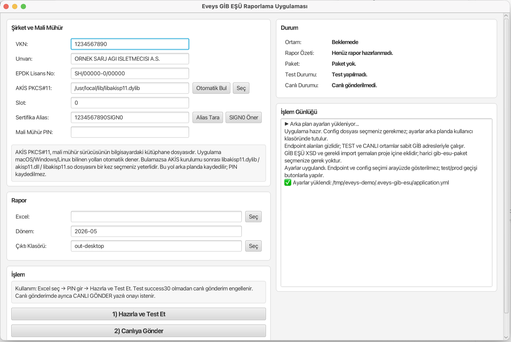

# Eveys GİB EŞÜ Reporter

<div align="center">


Elektrikli araç şarj işletmecileri için Excel'den GİB EŞÜ raporu üretme, mali mühürle imzalama ve test/canlı ortama gönderme aracı.

**Excel seç. Dönemi gir. Test et. Canlıya gönder.**

[Son sürümü indir](https://github.com/eveys-mobility/GIB-ESU-Reporter/releases/latest) ·
[Masaüstü kullanım](docs/MUHASEBE_KULLANIM.md) ·
[CLI kullanım](docs/CLI_USAGE.md) ·
[Paketleme](docs/PACKAGING.md) ·
[Güvenlik](docs/SECURITY.md)

</div>



## Ne İşe Yarar?

Eveys GİB EŞÜ Reporter, aylık elektrikli araç şarj verilerini GİB EŞÜ bildirim formatına dönüştüren Java tabanlı bir masaüstü ve CLI uygulamasıdır.

Uygulama şu akışı tek yerde toplar:

```text
Excel -> Plaka bazlı özet -> GİB EŞÜ XML -> XSD kontrol -> XAdES-BES imza -> ZIP -> GİB SOAP gönderimi -> Status kontrol
```

Özellikle muhasebe ve operasyon ekipleri için terminal gerektirmeyen, tek ekranlı bir masaüstü arayüz içerir. Geliştiriciler ve otomasyon akışları için aynı işlemler CLI komutlarıyla da çalıştırılabilir.

> Bu proje GİB, KamuSM veya AKİS'in resmi ürünü değildir. GİB EŞÜ gönderim sürecini kolaylaştırmak için hazırlanmış açık kaynak bir yardımcı araçtır.

## İndir

En güncel paketler GitHub Releases altında yayınlanır:

[Son sürüm indirme sayfası](https://github.com/eveys-mobility/GIB-ESU-Reporter/releases/latest)

| Platform | Paket | Kullanım |
| --- | --- | --- |
| Windows | `EveysGibEsuReporter-<version>-windows.zip` | ZIP'i aç, `EveysGibEsuReporter.exe` veya uygulama kısayolunu çalıştır |
| macOS | `EveysGibEsuReporter-<version>-macos.dmg` | DMG'yi aç, uygulamayı Applications'a taşı |
| Linux | `EveysGibEsuReporter-<version>-linux.tar.gz` | Arşivi aç, uygulama imajındaki launcher'ı çalıştır |
| CLI | `eveys-gib-esu-reporter-<version>-cli.jar` | Terminal/otomasyon kullanımı |

Windows ve Linux paketleri kendi Java runtime'ını içerir. Son kullanıcıya Maven veya kaynak kod gerekmez.

macOS paketi imzasızdır. İlk açılışta Gatekeeper ek onay isteyebilir.

## Muhasebe İçin Aylık Akış

1. Mali mühür USB cihazını takın.
2. Uygulamayı açın, şirket bilgilerini ve sertifika alias'ını bir kez ayarlayın.
3. Aylık Excel dosyasını seçin ve dönemi `YYYY-MM` formatında girin.
4. Önce `Hazırla ve Test Et`, başarıdan sonra `Canlıya Gönder` adımını çalıştırın.

Masaüstü uygulama test ortamından `success30` alınmadan canlı gönderimi açmaz. Canlı gönderimde ayrıca yazılı onay ister.

Detaylı son kullanıcı rehberi:

```text
docs/MUHASEBE_KULLANIM.md
docs/GUI_USAGE.md
```

## Öne Çıkanlar

- Excel'den şarj işlem verisi okuma
- Plaka normalizasyonu ve plaka bazlı aylık toplamlar
- GİB EŞÜ XML üretimi
- Proje içine gömülü GİB EŞÜ XSD dosyalarıyla doğrulama
- Mali mühür ile XAdES-BES XML imzası
- Yerel XML imza doğrulama
- ZIP paket ve Base64 çıktı üretimi
- SOAP WS-Security imzalı GİB gönderimi
- Test ve canlı ortam desteği
- Status sonucu için otomatik tekrar denemesi
- Başarılı paketleri ve servis cevaplarını arşivleme
- macOS, Windows ve Linux için otomatik GitHub Release paketleri

## Gereksinimler

Son kullanıcı için:

- Mali mühür cihazı
- AKİS/KamuSM mali mühür sürücüsü
- Mali mühür PIN'i
- Aylık Excel raporu
- Releases sayfasından indirilen masaüstü paket

Geliştirme ortamı için:

- Java 17 veya üzeri; JDK 17/21 önerilir
- Maven 3.x
- GitHub Release paketleri için GitHub Actions veya yerel `jpackage`

## Excel Formatı

Varsayılan olarak ilk sayfa ve ilk satır başlık satırı kabul edilir. Kolonlar boş bırakılırsa uygulama yaygın başlıkları otomatik arar:

```text
Plaka: plaka, plaka no, plate, vehicle plate, arac plaka
kWh: kwh, enerji, tuketim, energy, toplam kwh, sarj miktari
Tutar: tl, tutar, toplam tutar, gelir, amount, price, ucret
```

Farklı sayfa veya kolon adları için `config/application.yml` içindeki `excel` alanları düzenlenebilir.

## CLI Hızlı Başlangıç

Projeyi kaynak koddan çalıştırmak için:

```bash
java -version
mvn -version
mvn -DskipTests package
java -jar target/eveys-gib-esu-reporter-<version>.jar --help
```

Örnek config hazırlayın:

```bash
cp config/application.example.yml config/application.yml
```

`config/application.yml` içinde gerçek şirket ve mali mühür bilgilerini doldurun:

```text
company.vkn
company.unvan
company.epdkLisansNo
signing.pkcs11Library
signing.keyAlias
client.environment
```

Her ay tek komutla test ortamına gönderim:

```bash
java -jar target/eveys-gib-esu-reporter-<version>.jar monthly \
  --config config/application.yml \
  --input "sample.xlsx" \
  --period 2026-05 \
  --out out \
  --send
```

Canlı ortamda güvenlik amacıyla ek onay gerekir:

```bash
java -jar target/eveys-gib-esu-reporter-<version>.jar monthly \
  --config config/application.yml \
  --input "sample.xlsx" \
  --period 2026-05 \
  --out out-prod \
  --send \
  --confirm-prod "CANLI GONDER"
```

Daha detaylı terminal kullanımı:

```text
docs/CLI_USAGE.md
```

## Mali Mühür ve AKİS

Mali mühür imzası için AKİS PKCS#11 kütüphanesi gerekir. Masaüstü uygulama yaygın yolları otomatik dener; bulamazsa kullanıcı `akisp11.dll`, `libakisp11.dylib` veya `libakisp11.so` dosyasını bir kez seçebilir.

Yaygın alias biçimleri:

```text
<VKN>SIGN0
<VKN>SIGN1
```

Birden fazla alias varsa masaüstü uygulamadaki `Alias Tara` butonu veya CLI hata mesajındaki mevcut alias listesi kullanılabilir.

PIN hiçbir zaman config dosyasına yazılmaz.

## Güvenlik Modeli

- PIN kaydedilmez.
- Gerçek `config/application.yml` git'e eklenmez.
- Excel, XML, ZIP ve SOAP request/response çıktıları git'e eklenmez.
- GİB SSL truststore dosyaları kullanıcı klasöründe otomatik hazırlanır.
- Test `success30` olmadan masaüstü canlı gönderimi engeller.
- Canlı gönderim için ayrıca `CANLI GÖNDER` yazılı onayı istenir.

Detay:

```text
docs/SECURITY.md
docs/TRUSTSTORE.md
```

## GitHub Release Yayınlama

Release workflow dosyası:

```text
.github/workflows/release.yml
```

Yeni sürüm yayınlamak için `pom.xml` sürümü ile tag aynı olmalıdır:

```bash
git tag -a v<version> -m "Release v<version>"
git push origin v<version>
```

Workflow macOS, Windows, Linux ve CLI paketlerini üretip release asset olarak yükler. Detay:

```text
docs/PACKAGING.md
```

## Proje Yapısı

```text
src/main/java/dev/eveys/gibesu/
  audit/       Audit dosyaları
  cli/         Terminal komutları
  config/      Ayar modeli
  desktop/     JavaFX arayüz
  excel/       Excel okuma
  gib/         SOAP client ve paketleme
  model/       Veri modelleri
  sign/        PKCS#11 / XAdES-BES imza
  util/        Yardımcı sınıflar
  verify/      XML imza doğrulama
  xml/         GİB XML üretimi ve XSD doğrulama
```

## Sık Karşılaşılan Hatalar

### `PKIX path building failed`

Java GİB SSL sertifikasını tanımıyordur. Uygulama resmi GİB test/prod hostları için kullanıcı klasöründe otomatik truststore hazırlamaya çalışır. Manuel üretim gerekirse `docs/TRUSTSTORE.md` dosyasına bakın.

### `signing.keyAlias token icinde bulunamadi`

Config içindeki `signing.keyAlias` token içinde yoktur. Hata mesajındaki mevcut alias'lardan şirket mali mührüne ait olan seçilmelidir.

### `Gönderici yetkisi yok`

SOAP isteği GİB'e ulaşmış ancak kullanılan sertifika/VKN için gönderici yetkisi bulunamamıştır. Kişisel e-imza yerine şirket mali mührü kullanılmalı ve GİB test/prod tarafında ilgili VKN için yetki tanımlı olmalıdır.

### `154 İmza doğrulanamadı`

Yerel `verify-signature` sonucu, doğru mali mühür alias'ı, ZIP içeriği ve sertifika geçerliliği kontrol edilmelidir.

### `Log4j2 could not find a logging implementation`

Apache POI tarafından basılan uyarıdır. Rapor üretimi tamamlandıysa engelleyici değildir.

## Lisans

Bu proje `LICENSE` dosyasındaki lisans ile yayınlanır.
